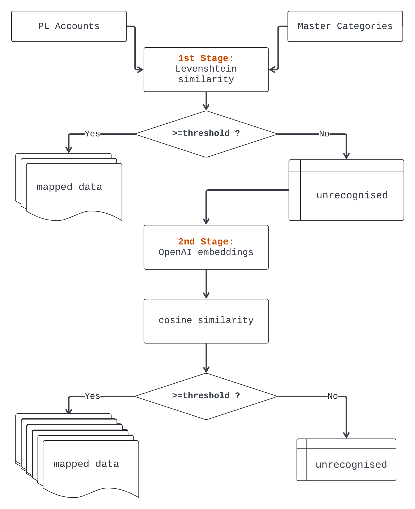

# ML-based mapping algorithm

To view a more detailed discussion and mapping results, please refer to [PDF](notebooks/1.Pipeline.pdf) version of experimental Jupyter notebook or a [regular](notebooks/1.Pipeline.ipynb) notebook. 

---

Relational tabular datasets often come from different sources and in different forms. To collect and aggregate such data, it is neccessary to map this data it into a single form. 

However, this process usually requires a great deal of manual effort, since a machine cannot simply understand that two entities like `R&D expenses:R&D team salary tax expenses` and `R&D team salary` essentially represent the same thing.

An approach implemented in the current repository attempts to automate this process. It leverages a two-staged mapping based on:

1. **Levenshtein similarity**, a string similarity metric used to measure the minimum number of single-character allowed operations (insertions, deletions, or substitutions) required to transform one string into another. 

This step maps PL accounts that have nearly one-to-one correspondence to Master Categories (like the example above). Accounts that remain unrecognised at this stage proceed to the next stage.

2. **OpenAI embeddings & cosine similarity.**  High-dimensional vector representations of text generated by advanced language models. Text embeddings capture rich semantic information, allowing to understand the meaning of a phrase beyond simple string matching.

This step involves embedding computation and applying cosine similarity to identify closest Master category pair for mapping. 

The pipeline can be visualised as follows:



Some proportion of accounts may still remain unmatched after this pipeline. These accounts will be labelled as unrecognized. 

In our case, the algorithm managed to map to Master categories **185 out of of 245** unique PL accounts, which corresponded to **7508 out of 10k** records of the dataset. 

## TODO:
- Perform evaluation on labelled dataset. 
- Create a system with continuous feedback loop involving human annotation. 
- Fine-tune the second stage to get more accurrate results. 
- Investigate new embedding models and preprocessing techniques.

## Build instructions 

To run the project, start with cloning this repo:

```
git clone https://github.com/artoriusss/pl-accounts-mapping.git
```

Then, create a virtual env and install the requirements:
```
cd pl-accounts-mapping
```
```
python -m venv .venv
source .venv/bin/activate
```
```
pip install -r requirements.txt
```
Ensure you paste your input data to the project so that the `/data` directory has the following structure:
```
data
├── master-categories.xlsx
├── transactions1.csv
└── transactions2.csv
```
After you've done this steps, you may experiment in a [Jupyter Notebook](notebooks/1.Pipeline.ipynb) or simply run a script with default parameters: 

```
python -m src.script
```

After running the script, you should be able to access the `final_transactions.csv` file in `/data` directory with mapped PL accounts. 